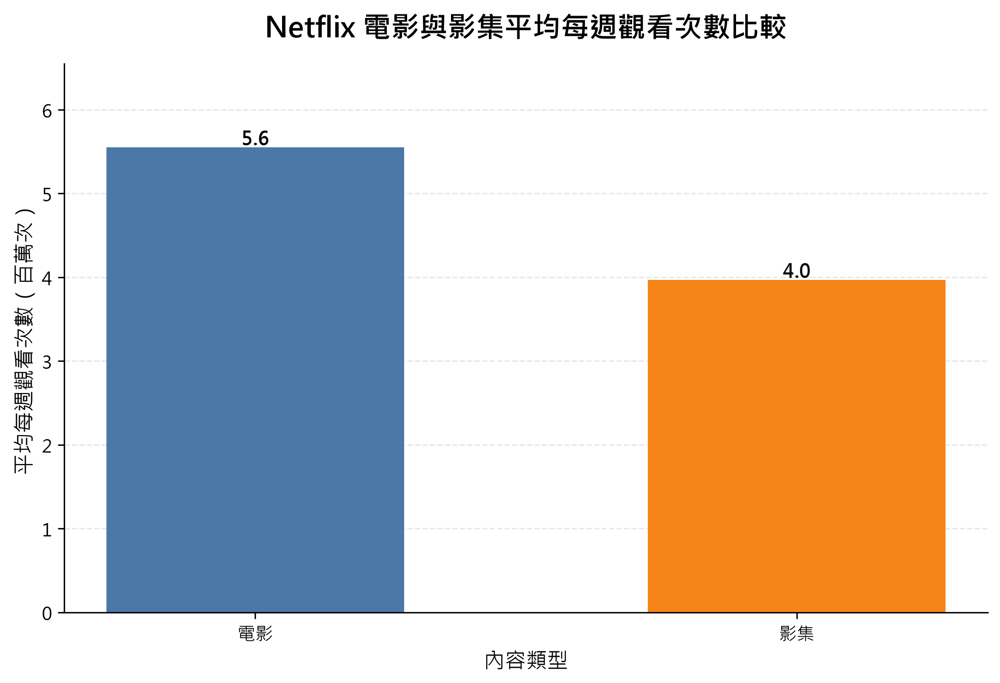
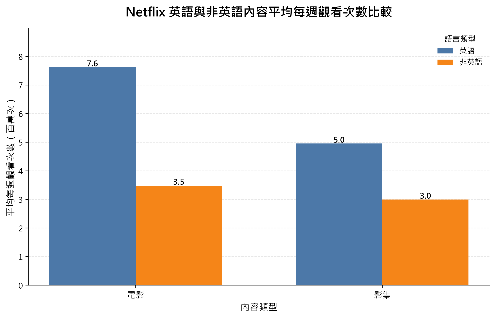
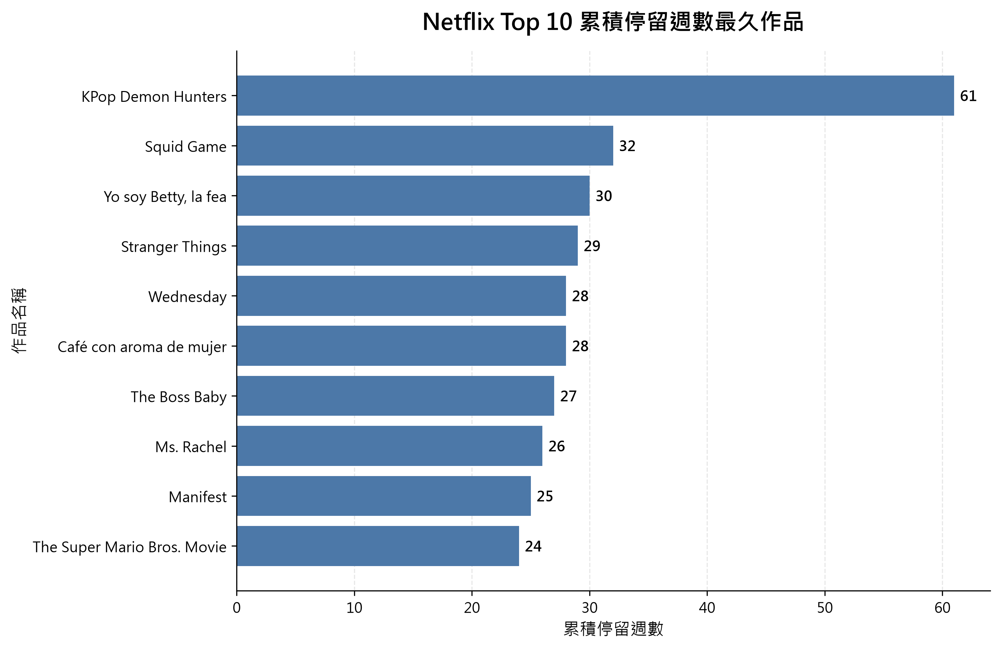
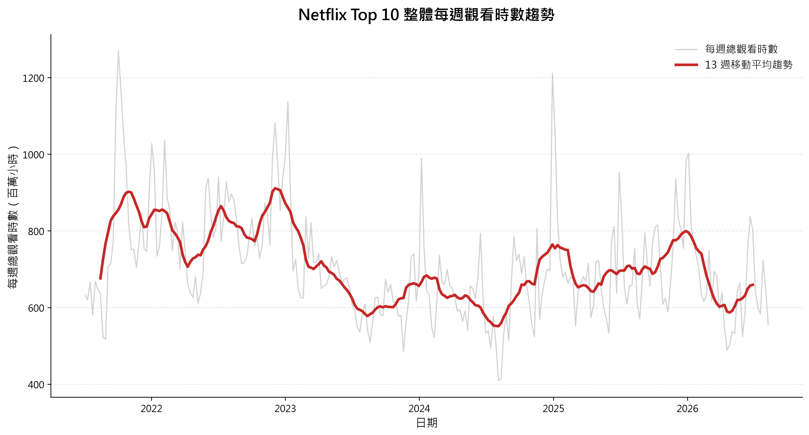
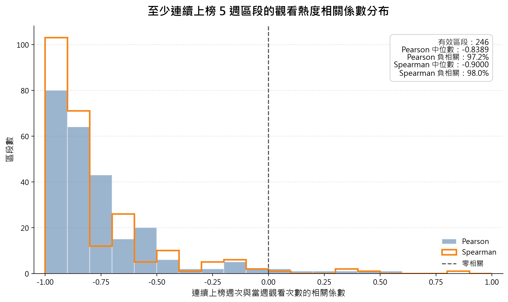

# Netflix 全球熱門內容與觀看趨勢分析

## 1. 專題簡介

本專題使用 Python 分析 Netflix 官方公開的全球 Top 10 歷史資料，透過資料擷取、資料清洗、資料分析、統計方法與資料視覺化，探討 Netflix 熱門內容的觀看表現與變化趨勢。

專案以 `main.py` 作為主要執行入口，可依序完成：
1. 從 Netflix 官方來源下載最新 Top 10 歷史資料
2. 清洗並整理原始資料
3. 執行五項研究問題的資料分析
4. 產生對應的視覺化圖表

專案另外建立基本測試，可使用 `python -m tests.test_analysis` 檢查資料品質、連續上榜區段與相關性分析函式。


---


## 2. 研究目的

本專題希望利用這些歷史資料，從不同角度觀察 Netflix 全球熱門內容的表現，包括電影與影集、英語與非英語內容之間的差異、作品的長期熱門程度，以及整體觀看時數隨時間的變化。
另外，也希望進一步分析作品在同一次連續上榜期間內，隨著上榜時間增加，其每週觀看熱度是否存在普遍的上升或下降趨勢。

透過本專題實作完整的資料分析流程，包含：
* 使用程式自動取得外部資料
* 資料清洗與資料品質檢查
* Pandas 分組、彙總與時間序列處理
* Pearson 與 Spearman 相關性分析
* 敏感度分析
* Matplotlib 資料視覺化
* 基本測試與 Traceback 除錯紀錄


---


## 3. 研究問題

本專題主要分析以下五個研究問題：

### 研究問題一
**Netflix 電影與影集的熱門程度是否有差異？**

以平均每週觀看次數比較電影與影集的整體觀看表現。

### 研究問題二
**英語與非英語內容的觀看表現有何不同？**

分別比較電影與影集中，英語與非英語內容的平均每週觀看次數。

### 研究問題三
**哪些作品在 Netflix Top 10 停留最久？**

使用 Netflix 提供的累積上榜週數，找出長期維持熱門的作品。

### 研究問題四
**Netflix 熱門內容是否存在明顯的時間趨勢？**

將每週 Top 10 內容的觀看時數加總，並搭配移動平均觀察不同年度及中期的觀看變化。

### 研究問題五
**作品在同一次 Netflix Top 10 連續上榜期間內，隨著上榜週數增加，當週觀看熱度是否具有普遍的變化趨勢？**

先依作品與日期建立每一次連續上榜區段，再以區段中的連續上榜週次與 `weekly_views` 計算 Pearson 與 Spearman 相關係數，最後統計所有有效區段的相關方向與係數分布。


---


## 4. 資料來源與資料說明

本專題使用 Netflix 官方公開的全球 Top 10 歷史資料。

程式透過 `scripts/fetch_data.py` 使用 `requests` 自動下載 Netflix 官方提供的 Excel 資料，並儲存至：
```text
data/raw/netflix_top10_raw.xlsx
```

完成資料清洗後，再輸出為：
```text
data/processed/netflix_top10_clean.csv
```

目前清洗後資料共有 **10,720 筆紀錄**。


### 4.1 主要欄位

| 欄位                           | 說明                  |
| ---------------------------- | ------------------- |
| `week`                       | 該筆 Top 10 資料所屬的週次日期 |
| `category`                   | 內容類別，包括英語／非英語電影與影集  |
| `weekly_rank`                | 該作品當週排名             |
| `show_title`                 | 作品名稱                |
| `season_title`               | 影集季度名稱              |
| `weekly_hours_viewed`        | 該週總觀看時數             |
| `runtime`                    | 作品片長                |
| `weekly_views`               | 該週觀看次數              |
| `cumulative_weeks_in_top_10` | 累積進入 Top 10 的週數     |


### 4.2 weekly_views 的資料限制

`weekly_views` 並不是整個歷史期間都有提供。
較早期的 Netflix Top 10 資料主要提供 `weekly_hours_viewed`，因此部分歷史紀錄的 `weekly_views` 為缺失值。

因此，本專題中需要使用觀看次數的研究問題，例如：
* 電影與影集平均每週觀看次數比較
* 英語與非英語內容觀看次數比較
* 連續上榜期間的觀看熱度相關性分析
都只使用具有有效 `weekly_views` 的資料進行計算。

另一方面，第四題的時間趨勢分析使用 `weekly_hours_viewed`，因此可以使用較完整的歷史資料範圍。


### 4.3 資料更新方式

由於 Netflix 官方 Top 10 資料會持續更新，本專題沒有將分析資料固定在單一版本。
每次執行完整流程時，程式會重新下載官方資料，因此資料筆數及部分分析結果可能隨 Netflix 新增每週資料而變動。
README 中列出的數值皆以本次專題完成時使用的 **10,720 筆清洗後資料**(截至2026/08/16)為基準。


---


## 5. 使用技術與專案架構

### 5.1 使用技術

本專題主要使用以下 Python 套件：

| 技術 / 套件    | 用途                                      |
| ---------- | --------------------------------------- |
| Python     | 專案主要開發語言                                |
| Pandas     | 資料讀取、清洗、分組、彙總與統計分析                      |
| NumPy      | 圖表繪製所需的數值處理                             |
| Matplotlib | 製作五項研究問題的視覺化圖表                          |
| Requests   | 從 Netflix 官方來源自動下載資料                    |
| OpenPyXL   | 供 Pandas 讀取 Netflix 官方 `.xlsx` Excel 資料 |
| SciPy      | 支援第五題 Spearman 相關係數計算                   |

另外使用 Python 標準函式庫 `pathlib` 管理專案中的檔案與資料夾路徑，避免將本機絕對路徑直接寫死在程式中。


### 5.2 專案架構

```text
netflix-analysis/
│
├─ data/
│  ├─ raw/
│  │  └─ netflix_top10_raw.xlsx
│  └─ processed/
│     └─ netflix_top10_clean.csv
│
├─ scripts/
│  ├─ __init__.py
│  ├─ fetch_data.py
│  ├─ clean_data.py
│  ├─ analyze_data.py
│  └─ visualize.py
│
├─ tests/
│  ├─ __init__.py
│  └─ test_analysis.py
│
├─ charts/
│  ├─ 01_films_vs_tv_average_views.png
│  ├─ 02_english_vs_non_english_average_views.png
│  ├─ 03_top10_longest_stay_titles.png
│  ├─ 04_weekly_total_hours_trend.png
│  └─ 05_continuous_run_correlation_distribution.png
│
├─ main.py
├─ DEBUGGING.md
├─ README.md
└─ requirements.txt
```


### 5.3 主要檔案功能

* `main.py`：專案主要執行入口，依序執行資料下載、資料清洗、資料分析與圖表輸出。
* `scripts/fetch_data.py`：使用 `requests` 下載 Netflix 官方 Top 10 Excel 資料。
* `scripts/clean_data.py`：檢查必要欄位、清理資料並輸出處理後的 CSV。
* `scripts/analyze_data.py`：負責五個研究問題的統計與分析邏輯。
* `scripts/visualize.py`：根據分析結果產生五張正式圖表。
* `tests/test_analysis.py`：使用 `assert` 檢查資料品質、連續上榜區段與相關性分析函式。
* `DEBUGGING.md`：記錄開發過程中的 Traceback、錯誤原因、檢查方式與修正結果。
* `requirements.txt`：記錄專案執行所需的第三方 Python 套件與版本。


---


## 6. 資料處理流程

Netflix 官方資料下載完成後，由 `scripts/clean_data.py` 進行資料檢查與清洗，再輸出為後續分析使用的 CSV。

整體流程如下：
```text
Netflix 官方 Excel 資料
        ↓
檢查原始資料檔案
        ↓
檢查必要欄位
        ↓
移除完全重複資料
        ↓
轉換日期與數值欄位型態
        ↓
處理缺失值與異常值
        ↓
輸出清洗後 CSV
        ↓
進入資料分析與視覺化
```


### 6.1 必要欄位檢查

清洗前會先確認資料中是否包含專題需要的欄位，若缺少必要欄位，程式會停止執行並回報錯誤，避免在資料格式不完整的情況下繼續分析。


### 6.2 重複資料與資料型態處理

資料清洗時會先移除內容完全相同的重複紀錄。

接著將 `week` 轉換為日期型態，並將以下欄位統一轉換為數值型態：
* `weekly_rank`
* `weekly_hours_viewed`
* `runtime`
* `weekly_views`
* `cumulative_weeks_in_top_10`

若數值欄位中出現無法轉換的內容，會以缺失值 `NaN` 處理，避免單筆異常資料造成整個程式中斷。


### 6.3 缺失值與異常值處理

`season_title` 在部分資料中原本沒有值，因此統一填入：
```text
Not specified
```

另外，在基本測試過程中發現資料中存在 **167 筆 `runtime <= 0` 的異常值**。
由於有效作品片長應大於 0，因此將：
`runtime <= 0`
視為缺失值處理，而不是刪除整筆紀錄。

這樣可以保留該筆資料中仍然有效的 `weekly_views`、`weekly_hours_viewed` 等欄位，供其他研究問題繼續使用。


### 6.4 清洗後資料

清洗完成後，資料會輸出至：
```text
data/processed/netflix_top10_clean.csv
```

後續五個研究問題的分析與圖表皆以此清洗後資料為基礎。


---


## 7. 研究結果與分析

### 7.1 Netflix 電影與影集的熱門程度是否有差異？

#### 分析方法

本題以 `weekly_views` 作為熱門程度的主要衡量指標，比較 Netflix Top 10 中電影（Films）與影集（TV）的**平均每週觀看次數**。
由於較早期的 Netflix 歷史資料沒有提供 `weekly_views`，因此本題只使用 `weekly_views` 有效的資料進行分析。

原始資料共有四種類別：
* Films (English)
* Films (Non-English)
* TV (English)
* TV (Non-English)

分析時將其重新整理為：
* Films
* TV

再分別計算兩種類型的平均 `weekly_views`。

#### 分析結果

| 內容類型  |    平均每週觀看次數 |
| ----- | ----------: |
| Films | 5,550,241 次 |
| TV    | 3,967,440 次 |
從結果可以看出，Netflix Top 10 中電影的平均每週觀看次數高於影集。

#### 結果解讀

若以「平均每週觀看次數」作為熱門程度指標，本資料集中電影的整體觀看表現高於影集。
不過，本題比較的是**觀看次數**，並不是總觀看時數。電影與影集在內容長度及觀看方式上存在差異，因此這個結果不能直接解讀為電影在所有觀看指標上都優於影集。

本題的結論應限定為：
> 在具有 `weekly_views` 的 Netflix Top 10 資料中，電影的平均每週觀看次數高於影集。

#### 視覺化結果




### 7.2 英語與非英語內容的觀看表現有何不同？

#### 分析方法

本題同樣以 `weekly_views` 作為觀看表現的主要衡量指標。
為避免電影與影集本身的觀看型態差異干擾語言比較，因此沒有直接把所有英語內容與所有非英語內容合併計算，而是先區分：
* Films
* TV
再分別比較其中：
* English
* Non-English
的平均每週觀看次數。

由於部分較早期資料沒有提供 `weekly_views`，本題同樣只使用 `weekly_views` 有效的資料進行分析。

#### 分析結果

| 內容類型  |    英語平均每週觀看次數 |   非英語平均每週觀看次數 |
| ----- | ------------: | ------------: |
| Films | 約 7,618,795 次 | 約 3,481,687 次 |
| TV    | 約 4,941,988 次 | 約 2,992,892 次 |

從結果可以看出：
* 電影中，英語內容的平均每週觀看次數明顯高於非英語內容。
* 影集中，英語內容的平均每週觀看次數同樣高於非英語內容。
* 英語電影的平均每週觀看次數是四組中最高的一組。

#### 結果解讀

在目前具有 `weekly_views` 的 Netflix Top 10 資料中，不論是電影或影集，英語內容的平均每週觀看次數都高於非英語內容。
電影的差距尤其明顯：
* 英語電影：約 762 萬次
* 非英語電影：約 348 萬次
影集則為：
* 英語影集：約 494 萬次
* 非英語影集：約 299 萬次

因此，本資料顯示英語內容在 Netflix 全球 Top 10 中具有較高的平均每週觀看次數。
不過，這個結果反映的是 Top 10 資料中的平均觀看表現，並不能直接推論所有 Netflix 使用者都偏好英語內容，也不能排除作品數量、內容供給、熱門作品集中程度等其他因素的影響。

本題的結論為：
> 在具有 `weekly_views` 的 Netflix Top 10 資料中，無論電影或影集，英語內容的平均每週觀看次數皆高於非英語內容。

#### 視覺化結果




### 7.3 哪些作品在 Netflix Top 10 停留最久？

#### 分析方法

本題使用 Netflix 官方資料中的 `cumulative_weeks_in_top_10`，代表作品累積進入 Top 10 的週數。
由於同一作品會在不同週重複出現，因此依 `show_title` 分組後，取得每部作品最大的 `cumulative_weeks_in_top_10`，再依累積週數由高至低排序，找出停留最久的前 10 名作品。

#### 分析結果

| 排名 | 作品                      | 累積 Top 10 週數 |
| -: | --------------------------- | -----------: |
|  1 | KPop Demon Hunters          |           61 |
|  2 | Squid Game                  |           32 |
|  3 | Yo soy Betty, la fea        |           30 |
|  4 | Stranger Things             |           29 |
|  5 | Café con aroma de mujer     |           28 |
|  6 | Wednesday                   |           28 |
|  7 | The Boss Baby               |           27 |
|  8 | Ms. Rachel                  |           26 |
|  9 | Manifest                    |           25 |
| 10 | The Super Mario Bros. Movie |           24 |

其中 **KPop Demon Hunters** 累積進入 Netflix Top 10 達 **61 週**，是目前資料中累積停留時間最長的作品。
第二名為 **Squid Game** 的 32 週，與第一名存在明顯差距。

#### 結果解讀

累積上榜週數可以反映作品在 Netflix Top 10 中維持熱門的時間長度。
相較於只觀察單週排名，這項指標更適合找出具有較長期熱門表現的作品。
從前 10 名結果可以看到，電影與影集都有長期停留在 Top 10 的作品，因此長期熱門並不限於單一內容類型。
不過，本題分析的是**累積進入 Top 10 的週數**，並不代表作品一定是連續上榜，也不能直接表示作品每一週都有相同程度的觀看熱度。

因此，本題的結論為：
> Netflix Top 10 中部分作品具有相當長的熱門生命週期，其中 KPop Demon Hunters 以累積 61 週位居目前資料第一名。

#### 視覺化結果




### 7.4 Netflix 熱門內容是否存在明顯的時間趨勢？

#### 分析方法

本題使用 `weekly_hours_viewed` 分析 Netflix Top 10 整體觀看時數隨時間的變化。
首先依 `week` 分組，將當週所有 Top 10 作品的 `weekly_hours_viewed` 加總，得到每週總觀看時數。

接著從三個角度觀察時間趨勢：
1. 找出每週總觀看時數最高與最低的週次。
2. 計算各年度的平均每週總觀看時數。
3. 使用 **13 週移動平均**平滑短期波動，觀察約一季尺度的中期趨勢。

#### 分析結果

每週總觀看時數最高的週次為：

| 項目 | 日期         |          每週總觀看時數 |
| -- | ---------- | ---------------: |
| 最高 | 2021-10-03 | 1,269,750,000 小時 |
| 最低 | 2024-08-04 |   409,400,000 小時 |

各年度平均每週總觀看時數如下：

|   年度 |      平均每週總觀看時數 |
| ---: | -------------: |
| 2021 | 780,349,615 小時 |
| 2022 | 815,746,346 小時 |
| 2023 | 667,511,698 小時 |
| 2024 | 641,707,692 小時 |
| 2025 | 709,790,385 小時 |
| 2026 | 655,793,939 小時 |

其中，**2022 年的平均每週總觀看時數最高**，約為 8.16 億小時；2023 與 2024 年則呈現下降，2025 年再度回升。

#### 結果解讀

從年度平均結果可以看出，Netflix Top 10 的整體觀看時數並不是持續單方向增加或下降，而是具有明顯的年度波動。

整體變化大致呈現：
```text
2021 → 2022 上升
2022 → 2024 下降
2024 → 2025 回升
```

13 週移動平均則可以減少單週熱門作品造成的劇烈波動，使中期的觀看變化更容易觀察。
因此，本題不適合直接下結論認為 Netflix 熱門內容的觀看時數「逐年增加」或「逐年下降」，而應解讀為：
> Netflix Top 10 整體觀看時數存在明顯的時間波動，不同年度之間具有高低變化。2022 年平均每週觀看時數最高，2023 至 2024 年下降後，2025 年出現回升。

由於目前 2026 年資料尚未涵蓋完整年度，因此 2026 年的數值只能代表目前已公布週次的平均表現，不宜直接作為完整年度與其他年份比較的最終結論。

#### 視覺化結果




### 7.5 作品在同一次連續上榜期間內，觀看熱度是否具有普遍的變化趨勢？

#### 分析目的

Netflix 官方資料提供 `cumulative_weeks_in_top_10`，但這個欄位代表的是作品**累積進入 Top 10 的週數**，不一定等於目前這一次連續上榜的第幾週。
例如某作品可能：
```text
連續上榜數週
→ 掉出 Top 10
→ 過一段時間重新上榜
```
重新上榜後已經屬於另一段觀看熱度週期，因此若直接使用 `cumulative_weeks_in_top_10` 分析，可能把不同上榜時期混在一起。

所以本題改以「**同一次連續上榜區段**」作為分析單位。

---

#### 分析方法

##### 1. 建立作品分析單位

為了區分不同作品或不同季度，程式建立 `analysis_unit`。

TV 類型使用：
```text
category + show_title + season_title
```

電影使用：
```text
category + show_title + runtime
```

接著排除沒有 `weekly_views` 的資料，因為本題需要使用每週觀看次數衡量觀看熱度。

##### 2. 建立連續上榜區段

將同一個 `analysis_unit` 依 `week` 排序，再計算與上一筆紀錄相隔的天數。

如果相鄰兩筆資料：
```text
相隔 7 天
```
代表作品持續連續上榜。

如果：
```text
不是相隔 7 天
```
則代表中途曾掉出 Top 10，重新建立新的 `streak_id`。

每一個連續區段再重新建立：
```text
streak_week = 1, 2, 3, 4, ...
```
因此 `streak_week` 才是本題真正用來表示「這一次連續上榜第幾週」的欄位。

##### 3. 篩選有效區段

正式分析設定為至少連續上榜 **5 週**。
此外，如果某一區段內的 `weekly_views` 完全相同，就無法得到有意義的相關係數，因此不納入正式結果。

##### 4. 計算相關係數

每一個有效連續上榜區段分別計算：

* **Pearson 相關係數**：觀察連續上榜週次與觀看次數之間的線性相關程度。
* **Spearman 相關係數**：觀察隨著上榜週次增加，觀看次數是否具有一致的單調變化趨勢。

最後不是將全部資料混在一起計算一個相關係數，而是統計所有有效區段的：
* 相關係數中位數
* 相關係數平均數
* 負相關比例

這樣可以觀察下降趨勢是否普遍存在於不同作品的連續上榜區段中。

---

#### 正式分析結果

至少連續上榜 5 週的有效區段共有：
**248 個**

結果如下：

| 指標    | Pearson | Spearman |
| ----- | ------: | -------: |
| 平均數   | -0.7533 |  -0.8022 |
| 中位數   | -0.8389 |  -0.9000 |
| 負相關比例 |   96.8% |    97.6% |

兩種相關係數的中位數都呈現強烈負相關，而且超過 96% 的有效區段為負相關。
這表示多數作品在同一次連續進入 Netflix Top 10 的過程中，隨著上榜週數增加，當週觀看次數通常會逐漸下降。

---

#### 敏感度分析

為了確認「至少連續 5 週」這個門檻是否會明顯影響結論，另外以 4、6、8 週重新分析。

| 最低連續週數 | 有效區段數 | Pearson 中位數 | Pearson 負相關比例 | Spearman 中位數 | Spearman 負相關比例 |
| -----:     | ----:     | ----------:    | ------------:     | -----------:    | -------------:    |
|    4 週     |   476     |     -0.8502    |         97.7%     |      -0.8765    |          97.3%    |
|    5 週     |   248     |     -0.8389    |         96.8%     |      -0.9000    |          97.6%    |
|    6 週     |   143     |     -0.8332    |         95.8%     |      -0.9286    |          96.5%    |
|    8 週     |    60     |     -0.7745    |         96.7%     |      -0.8863    |          96.7%    |

雖然最低連續週數門檻提高後，有效區段數會下降，但不同門檻下的 Pearson 與 Spearman 中位數仍然維持明顯負值，而且負相關比例皆超過 95%。
因此，主要結論並不是只有在 5 週門檻下才成立。

---

#### 結果解讀

本題結果顯示：

> 在至少連續上榜 5 週的有效區段中，作品的當週觀看次數通常會隨著連續上榜週數增加而下降。

Pearson 與 Spearman 都得到高度一致的負相關結果，而不同最低連續週數門檻的敏感度分析也呈現相似方向，因此這項下降趨勢具有相當程度的一致性。

不過，相關性代表的是變數之間的共同變化趨勢，並不能直接證明「上榜時間增加」本身造成觀看次數下降。

作品類型、上映時間、新內容競爭、觀眾已完成觀看等因素，都可能影響作品後續的觀看熱度。

因此，本題較適合解讀為：

> Netflix Top 10 作品在同一次持續上榜期間內，通常呈現前期觀看熱度較高、之後逐步下降的普遍現象。

#### 視覺化結果




---


## 8. 測試與除錯

除了確認主程式可以正常執行，本專題另外建立基本測試，用來檢查清洗後資料品質，以及第五題的重要分析邏輯。

測試可透過以下指令執行：

```powershell
python -m tests.test_analysis
```

目前共有三項基本測試。

### 8.1 資料品質測試

`test_data_quality()` 會讀取正式清洗後資料，檢查：
* DataFrame 不可為空
* 9 個必要欄位皆必須存在
* 不應存在完全重複資料
* `week`、`category`、`weekly_rank`、`show_title`、`season_title`、`weekly_hours_viewed`、`cumulative_weeks_in_top_10` 不應有缺失值
* `runtime` 與 `weekly_views` 至少必須存在部分有效資料
* `week` 必須為日期型態
* `weekly_rank` 必須介於 1～10
* `weekly_hours_viewed` 不得出現負值
* 有效的 `weekly_views` 不得出現負值
* 有效的 `runtime` 必須大於 0
* `cumulative_weeks_in_top_10` 必須至少為 1
* `category` 必須屬於 Netflix 官方四種類別之一

測試過程曾因資料中存在 `runtime <= 0` 的紀錄而發生 `AssertionError`。進一步檢查後發現共有 167 筆異常值，因此在資料清洗階段補上規則，將 `runtime <= 0` 視為缺失值，再重新執行測試確認修正成功。

---

### 8.2 連續上榜區段測試

`test_consecutive_segments()` 用來檢查第五題建立的連續上榜區段與主分析結果。

主要檢查：
* 建立出的連續上榜分析資料不可為空
* 同一個 `analysis_unit` 與 `streak_id` 區段內，相鄰紀錄必須剛好相隔 7 天
* 每一個區段的 `streak_week` 必須從 1 開始，並依序連續增加
* 使用至少連續 5 週作為主分析門檻後，必須存在有效區段
* 正式分析結果中的所有區段都必須至少 5 週
* Pearson 與 Spearman 相關係數都必須介於 -1～1

這項測試主要用來確認第五題的連續上榜區段與相關性結果符合預期條件。

---

### 8.3 相關性函式測試

`test_correlation_function()` 使用一組答案已知的小型測試資料：
```text
streak_week：  1, 2, 3, 4, 5
weekly_views：500, 400, 300, 200, 100
```

在這組資料中，連續上榜週次持續增加，而觀看次數完全遞減，因此預期：
```text
Pearson = -1
Spearman = -1
```

測試會確認：
* 固定資料只產生 1 個有效區段
* Pearson 與 Spearman 都位於 -1～1
* Pearson 計算結果應接近 -1
* Spearman 計算結果應接近 -1

藉由使用答案已知的資料，可以確認相關性分析函式的計算結果符合預期。

---

### 8.4 測試結果

完成資料清洗與程式整理後重新執行測試：
```text
✓ 資料品質測試通過
✓ 連續上榜區段測試通過
✓ 相關性函式測試通過

===== 所有基本測試通過 =====
```

---

### 8.5 Traceback 除錯紀錄

開發過程中另外保留兩個實際除錯案例。

#### runtime 異常值造成 AssertionError

資料品質測試中的：
```python
assert (df["runtime"].dropna() > 0).all()
```
曾發生 `AssertionError`。

進一步檢查後發現資料中共有 167 筆 `runtime <= 0`，因此在資料清洗階段加入異常值處理，再重新執行測試確認修正成功。

#### mean() 拼字錯誤造成 AttributeError

計算年度平均觀看時數時，曾將：
```python
.mean()
```

誤寫為：
```python
.maen()
```

Traceback 顯示：
```text
AttributeError: 'SeriesGroupBy' object has no attribute 'maen'
```

透過 Traceback 找到錯誤所在的程式行後，將方法名稱修正為 `mean()`，程式即可正常執行。

完整的錯誤現象、Traceback、檢查方式及修正流程記錄於：

```text
DEBUGGING.md
```


---


## 9. 執行方式與完整流程

### 9.1 安裝專案套件

先建立並啟用 Python 虛擬環境，再於專案根目錄安裝 `requirements.txt` 中的套件：
```powershell
python -m pip install -r requirements.txt
```

目前專案使用的主要第三方套件包括：
```text
matplotlib
numpy
openpyxl
pandas
requests
scipy
```

---

### 9.2 執行完整分析流程

在專案根目錄執行：
```powershell
python main.py
```

`main.py` 會依序完成：
```text
下載 Netflix 官方資料
        ↓
清洗並輸出處理後資料
        ↓
執行五個研究問題分析
        ↓
產生五張視覺化圖表
        ↓
分析流程完成
```

執行成功後，清洗後資料會輸出至：
```text
data/processed/netflix_top10_clean.csv
```

圖表則會輸出至：
```text
charts/
```

由於資料來源為 Netflix 官方持續更新的 Top 10 歷史資料，因此重新執行 `main.py` 時，資料筆數與部分分析結果可能隨最新一週資料而改變。

---

### 9.3 執行基本測試

基本測試不包含在 `main.py` 的完整分析流程中，需要另外執行：
```powershell
python -m tests.test_analysis
```

測試主要檢查：
* 清洗後資料品質
* 連續上榜區段邏輯
* Pearson / Spearman 相關性函式

全部通過時會顯示：
```text
✓ 資料品質測試通過
✓ 連續上榜區段測試通過
✓ 相關性函式測試通過

===== 所有基本測試通過 =====
```

---

### 9.4 完整執行驗證

專題完成後曾由專案根目錄直接執行：
```powershell
python main.py
```

成功完成：
* Netflix 官方資料取得
* 資料清洗
* 五項研究分析
* 五張圖表輸出

過程中未發生 Traceback，也不需要手動修改中間資料，最後正常顯示：
```text
===== Netflix 分析流程完成 =====
```

因此目前專案可以透過單一主程式完成完整的資料分析流程。


---


## 10. 整體研究結論

本專題利用 Netflix 官方全球 Top 10 歷史資料，從內容類型、語言、作品長期熱門程度、時間趨勢與連續上榜期間的觀看熱度變化等角度進行分析。

綜合五個研究問題，可以得到以下主要結果。

### 10.1 電影的平均每週觀看次數高於影集

在具有 `weekly_views` 的資料中：
* Films 平均每週觀看次數：約 **555 萬次**
* TV 平均每週觀看次數：約 **397 萬次**

若以平均每週觀看次數作為熱門程度指標，電影的整體表現高於影集。
不過，這項結果只代表觀看次數，並不能直接推論電影的總觀看時數也一定高於影集。

---

### 10.2 英語內容的平均觀看次數高於非英語內容

不論是電影或影集，英語內容的平均每週觀看次數都高於非英語內容。

其中：
* 英語電影：約 **762 萬次**
* 非英語電影：約 **348 萬次**
* 英語影集：約 **494 萬次**
* 非英語影集：約 **299 萬次**

因此，在目前 Netflix Top 10 的有效 `weekly_views` 資料中，英語內容具有較高的平均觀看表現。

---

### 10.3 部分作品具有長期維持熱門的能力

以 Netflix 官方提供的 `cumulative_weeks_in_top_10` 分析後，目前累積停留 Top 10 最久的作品為：
**KPop Demon Hunters：61 週**

其次包括：
* Squid Game：32 週
* Yo soy Betty, la fea：30 週
* Stranger Things：29 週

結果顯示，Netflix Top 10 中除了短期熱門作品，也存在可以長時間維持曝光與觀看熱度的內容。

---

### 10.4 Netflix Top 10 整體觀看時數存在明顯時間波動

將每週所有 Top 10 作品的 `weekly_hours_viewed` 加總後，可以看到不同年份之間存在明顯變化。

各年度平均每週總觀看時數呈現：
```text
2021 → 2022 上升
2022 → 2024 下降
2024 → 2025 回升
```

其中 2022 年的平均每週總觀看時數最高。
因此，Netflix Top 10 的整體觀看時數並不是持續上升或持續下降，而是隨時間呈現不同階段的波動。

由於 2026 年資料尚未涵蓋完整年度，因此不宜將目前 2026 年平均值直接視為完整年度結果。

---

### 10.5 作品在持續上榜期間，觀看熱度通常逐步下降

第五題以同一次連續上榜區段為分析單位，正式分析至少連續上榜 5 週的有效區段。
目前共有 **248 個有效區段**。

結果為：
* Pearson 中位數：**-0.8389**
* Pearson 負相關比例：**96.8%**
* Spearman 中位數：**-0.9000**
* Spearman 負相關比例：**97.6%**

另外以至少連續 4、6、8 週重新進行敏感度分析後，負相關比例仍皆超過 95%。

因此可以觀察到一個相當一致的現象：
> 多數作品在同一次持續進入 Netflix Top 10 的期間內，通常在前期具有較高觀看熱度，之後隨著連續上榜週數增加，當週觀看次數逐步下降。

這項結果代表的是相關趨勢，不能直接解讀為「上榜時間增加造成觀看次數下降」，因為作品上映時間、內容類型、新作品競爭及觀眾觀看完成等因素都可能同時影響觀看熱度。

---

### 10.6 整體觀察

綜合本專題結果，Netflix 全球 Top 10 資料呈現出幾個主要特徵：
* 電影平均每週觀看次數高於影集。
* 英語內容在電影與影集中皆具有較高的平均觀看次數。
* 少數作品可以長期維持在全球 Top 10。
* Netflix Top 10 的總觀看時數會隨年度產生明顯波動。
* 作品即使能持續留在 Top 10，其每週觀看熱度通常仍會隨時間逐步下降。

因此，Netflix Top 10 的「熱門」並不是單一指標可以完全描述，而需要同時考慮觀看次數、觀看時數、累積上榜週數以及作品隨時間的熱度變化。


---


## 11. 專題限制與可改進方向

### 11.1 weekly_views 並非完整歷史期間都有資料

Netflix 較早期的 Top 10 歷史資料沒有提供 `weekly_views`，因此使用觀看次數的研究問題只能分析具有有效 `weekly_views` 的期間。
這會使第一題、第二題與第五題使用的歷史範圍短於第四題的 `weekly_hours_viewed` 時間趨勢分析。
未來若 Netflix 提供更完整的歷史觀看次數資料，可以重新執行分析，觀察較長時間範圍下的結果是否一致。

---

### 11.2 Netflix Top 10 資料只包含熱門作品

本專題使用的是 Netflix 全球 Top 10 資料，因此分析對象本身已經是每週表現較熱門的作品。
資料中沒有包含未進入 Top 10 的其他 Netflix 內容，因此本專題的結果主要描述：
> Netflix 全球 Top 10 熱門作品之間的觀看表現與變化。

不能直接將結果推論到 Netflix 平台上的所有作品。

---

### 11.3 2026 年資料尚未涵蓋完整年度

第四題會比較各年度的平均每週總觀看時數，但目前 2026 年尚未結束，因此 2026 年的年度平均只代表目前已公布週次。
因此，在解讀年度趨勢時，2026 年不適合直接與已經完整結束的年度做最終比較。

---

### 11.4 相關性不能直接解釋為因果關係

第五題發現連續上榜週次與 `weekly_views` 普遍呈現負相關，但相關性本身不能證明：
> 因為上榜週數增加，所以觀看次數下降。

實際觀看熱度還可能受到其他因素影響，例如：
* 新作品上映造成競爭
* 作品類型與受眾差異
* 上映初期集中觀看
* 觀眾逐漸完成作品觀看
* 不同地區或市場的熱門程度變化

因此，第五題的結果應解讀為「普遍存在的變化趨勢」，而不是因果關係。

---

### 11.5 作品識別方式仍有資料本身的限制

第五題為了建立連續上榜區段，需要先建立作品分析單位。
目前：
* TV 使用 `category + show_title + season_title`
* Films 使用 `category + show_title + runtime`

這種方式可以降低同名作品或不同季度被混在一起的機會，但仍然是依照 Netflix 公開資料現有欄位建立的識別方式。
如果未來資料來源提供作品唯一 ID，可以改用唯一識別碼，讓不同作品的區分更加可靠。

---

### 11.6 可改進方向

未來可以從以下方向繼續擴充：

* 加入更多內容特徵或外部資料，分析哪些因素與長期熱門程度相關
* 進一步比較不同類別作品的連續上榜熱度下降速度
* 將分析結果製作成互動式 Dashboard
* 建立自動化排程，定期下載最新 Netflix Top 10 資料並重新產生分析結果
* 若取得更完整的作品識別資料，可改善作品與季度的辨識方式
* 加入更多統計方法，進一步檢驗不同內容類型之間的差異是否具有統計顯著性

本專題目前的重點仍放在完成一套可重複執行的 Python 資料分析流程，並確保研究問題、資料處理、統計分析、視覺化與測試之間具有一致的邏輯。
